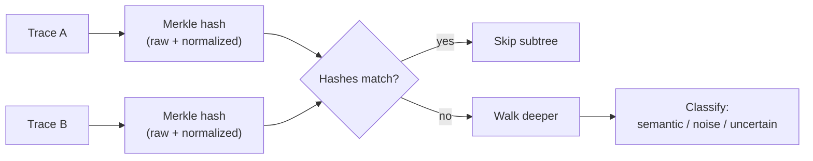
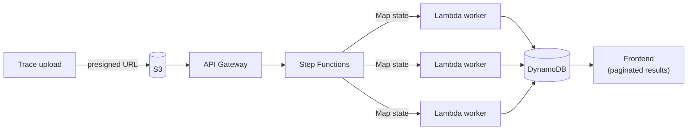

# TraceDiff

Structural diffing of execution traces — find which differences are bugs
and which are noise, in **O(N + D·log N)** instead of O(N²·m²).

```
Trace A (100K events) ──► Merkle build ──┐
                                          ├──► Diff walk ──► 3 semantic diffs (0.3ms)
Trace B (100K events) ──► Merkle build ──┘    98.3% of nodes skipped
```

## What it does

Given two execution traces (function calls, spans, log lines, state
transitions — up to millions of events each), TraceDiff tells you:

- **Semantic diffs** — real behavioral changes: a DB query returning 0 rows,
  a new span appearing, an HTTP 200 turning into a 500
- **Noise** — timestamp jitter, rotated request IDs, reordered concurrent
  operations
- **Uncertain** — large numeric changes that might or might not matter

Core idea: Merkle-hash each trace tree after normalizing with pluggable
equivalence rules. Identical subtrees → identical hashes → skip in O(1).
The top-down walk visits only the ~0.1% that actually changed.

## Use cases

- **CI regression gating** — diff a new deploy's trace against the last
  known-good baseline; block the deploy if anything comes back `semantic`.
- **Canary / shadow comparison** — mirror real traffic to old and new
  versions, diff traces sharing a correlation ID, catch behavioral drift
  before full rollout.
- **Postmortem debugging** — diff a failing run against a passing one for
  the same input; skip the noise, go straight to what actually diverged.

## Quick start

```bash
# Auto-detect format, all default rules
bun run src/cli/main.ts trace_a.json trace_b.json

# With stats + specific rules
bun run src/cli/main.ts trace_a.json trace_b.json \
  -r ignore-timestamps,canonicalize-ids,numeric-tolerance -s

# Shareable HTML report, noise included
bun run src/cli/main.ts trace_a.json trace_b.json --include-noise --html-out report.html

# Machine-readable output
bun run src/cli/main.ts trace_a.json trace_b.json -o json > diff.json
```

Exit codes: `0` = no semantic diffs · `1` = semantic diffs found · `2` = error.
Full options: `bun run src/cli/main.ts --help`.

Generate synthetic test traces:

```bash
bun run src/bench/generate.ts --size 100000 --diffs 5 --output fixtures/demo/
```

## Benchmarks

| Nodes | Diffs | Skip % | Diff time | Total |
|---|---|---|---|---|
| 1K | 5 | ~98% | < 1ms | ~12ms |
| 100K | 100 | ~98.3% | 0.3ms | ~213ms |
| 1M | 100 | ~99.99% | < 1ms | ~12s |

`Total` includes parsing and the Merkle build; the diff walk itself
(`Diff time`) stays sub-millisecond regardless of trace size — that gap
between the two columns at 1M nodes *is* the pitch: divergence-finding
cost is proportional to the size of the diff, not the size of the trace.

Run it yourself: `bun run bench` (add `--include-huge` for the 1M-node cell).

## Architecture

High level only — full derivation, diagrams, and complexity proofs live
in the docs linked below.

**Diffing engine**
- Each trace becomes a tree; every node gets two SHA-256 hashes — one
  from raw content, one from content normalized by pluggable rules
  (timestamps, IDs, jitter tolerance)
- Matching hashes mean a subtree is safely skipped; only true divergence
  gets walked, so cost scales with the size of the diff, not the trace
- Every diff that survives gets classified — semantic, noise, or
  uncertain — never just "different"



**AWS deployment**
- Traces upload directly to S3 via presigned URLs, bypassing API
  Gateway's payload limit
- API Gateway triggers Step Functions, which fans a large trace out
  across parallel Lambda workers (Map state) to build and diff it
- Results land in DynamoDB, paginated for the frontend, so a
  million-node result never has to load into the browser at once



Both diagrams above are deliberately high level — step-by-step walkthroughs,
edge cases, and the full dual-hash derivation are in the in-depth docs below.

**In-depth reference:** [docs/architecture.md](docs/architecture.md)
(dual-hash formulas, 3-tier indexing, complexity tables) or the
[Live Docs Portal](https://marsyg.github.io/TraceDiff/docs/) for the
full visual guide — tree diagrams, edge cases, animated walkthroughs.

## Live deployment (dev)

| Resource | Value |
|---|---|
| Web Visualizer | https://marsyg.github.io/TraceDiff/ |
| API Gateway Endpoint | https://adw2m5fxnj.execute-api.us-east-1.amazonaws.com/dev/ |
| Region | us-east-1 |
| S3 Upload Bucket | `tracediff-uploads-140023404870-dev` |
| DynamoDB Jobs Table | `tracediff-jobs-dev` |
| DynamoDB Results Table | `tracediff-results-dev` |
| Step Functions ARN | `arn:aws:states:us-east-1:140023404870:stateMachine:DiffStateMachine-2ryHzalVPc5N` |

Override the API target on the hosted visualizer:
`https://marsyg.github.io/TraceDiff/?api=<your-endpoint>`

## Contributing

Setup, scripts, lint/format rules, project structure, and branch ownership
→ **[CONTRIBUTING.md](CONTRIBUTING.md)**.

## License

MIT
