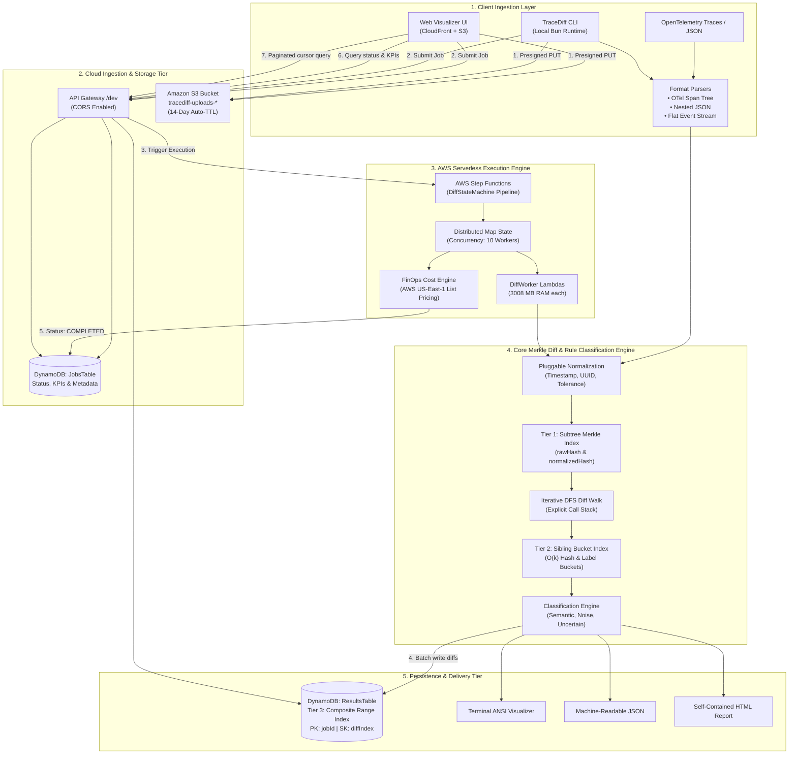

# TraceDiff

> Structural diffing of execution traces — find which differences are **bugs** and which are **noise**, in O(N + D·log N) instead of O(N²m²).
---

## What It Does

Given two execution traces (function calls, spans, log lines, state transitions — up to millions of events each), TraceDiff tells you:

- **Semantic diffs** — real behavioral changes: a DB query returning 0 rows, a new span appearing, an HTTP 200 turning into a 500
- **Noise** — timestamp jitter, rotated request IDs, reordered concurrent operations
- **Uncertain** — large numeric changes that might or might not matter

**Core idea:** Merkle-hash each trace tree after normalizing with pluggable equivalence rules. Identical subtrees → identical hashes → skip in O(1). The top-down walk visits only the ~0.1% that actually changed.

```
Trace A (100K events) ──► Merkle build ──┐
                                          ├──► Diff walk ──► 3 semantic diffs (0.3ms)
Trace B (100K events) ──► Merkle build ──┘    98.3% of nodes skipped
```

---

## Tech Stack

| Layer | Tool | Why |
|-------|------|-----|
| Language | TypeScript | Hackathon speed + type safety |
| Runtime (local) | **Bun** | Native TS execution, built-in test runner, fast |
| Package manager | **pnpm** | Fast installs, strict `node_modules`, no phantom deps |
| Linting + Formatting | **Biome** | Single tool replaces ESLint + Prettier, zero config drift |
| Lambda runtime | Node 22.x | AWS-official, stable — Bun bundles handlers before deploy |
| Lambda bundler | `bun build --target=node` | Single JS file per handler, no webpack |
| Infra | SAM + CloudFormation | One template, one deploy command |

---

## Contributor Setup

> **Everyone on the team must follow these steps exactly.** Skipping any step causes lint/format conflicts in PRs.

### 1. Prerequisites

Install these globally once:

```bash
# Install Bun (Windows — run in PowerShell)
powershell -c "irm bun.sh/install.ps1 | iex"

# Install pnpm
npm install -g pnpm

# Verify
bun --version    # should be 1.x
pnpm --version   # should be 9.x or 11.x
```

### 2. Clone + Install

```bash
git clone <repo-url>
cd trace-diff

# Install all dependencies
pnpm install

# Install git hooks (pre-commit Biome check, pre-push typecheck)
# Use 'bun run' — pnpm 11 blocks scripts from packages with install scripts
bun run hooks:install
```

> **Do not use `npm install` or `yarn`.** The repo uses a pnpm lockfile (`pnpm-lock.yaml`).
> Using npm generates a `package-lock.json` and causes merge conflicts.

> **Use `bun run` not `pnpm run` for all scripts in this repo.**
> pnpm 11 blocks execution when any dependency has an unapproved install script (lefthook does).
> `bun run` has no such restriction and just works.

### 3. Verify Setup

```bash
# Run tests (0 tests, 0 failures on a fresh clone)
bun test

# Run linter (exit 0 = clean)
bun run lint

# Run formatter check
bun run format:check
```

If all three exit with no errors, you're good to go.

---

## Available Scripts

```bash
bun run dev              # Run CLI directly
bun test                 # Run test suite
bun run bench            # Run benchmark matrix
bun run build            # Bundle Lambda handlers → dist/lambda/
bun run lint             # Biome lint check (no auto-fix)
bun run lint:fix         # Biome lint + auto-fix
bun run format           # Biome format + auto-fix
bun run format:check     # Biome format check only (no changes)
bun run check            # Biome lint + format together (run before pushing)
bun run typecheck        # tsc --noEmit
bun run hooks:install    # Install git pre-commit/pre-push hooks (once per clone)
```

---

## Linting + Formatting (Biome)

We use **[Biome](https://biomejs.dev/)** — one tool that handles both linting and formatting.
It replaces ESLint + Prettier. Every contributor gets the same output automatically.

### Rules enforced

- No `any` — use `unknown` instead
- No unused variables or imports
- No `console.log` in `src/core/` or `src/rules/` (use CLI output layer)
- Double quotes for strings
- 2-space indentation
- Trailing commas in multi-line structures
- Semicolons required

### Fix before committing

```bash
bun run lint:fix && bun run format
```

### VS Code setup

Install the **Biome extension**: search `biomejs.biome` in the Extensions panel.

Add this to your **workspace** `.vscode/settings.json` (already committed in the repo):

```json
{
  "editor.defaultFormatter": "biomejs.biome",
  "editor.formatOnSave": true,
  "editor.codeActionsOnSave": {
    "quickfix.biome": "explicit"
  }
}
```

> **Disable ESLint and Prettier extensions** if you have them — they will conflict with Biome and produce divergent formatting that shows up as noise in diffs.

---

## Project Structure

```
tracediff/
├── src/
│   ├── core/               # Merkle builder, diff engine, matcher, hash, types
│   ├── rules/              # Equivalence-rule registry + 5 built-in rules
│   ├── parsers/            # Input parsers: nested JSON, flat spans, OTel
│   ├── cli/                # CLI entry point + terminal/JSON/HTML output formatters
│   ├── viz/                # Reserved for visualization work (HTML report lives in src/cli/format-html.ts)
│   ├── lambda/             # AWS Lambda handlers (submit-job, get-job, diff-worker…)
│   └── bench/              # Synthetic trace generator + benchmark runner
├── test/                   # Unit + integration tests incl. lambda handlers (bun test)
│   └── setup.ts            # Test preload: conditional AWS-SDK mocks (see Tests)
├── frontend/               # Single-file web app (unified diff tree + KPI bar + detail panel)
├── fixtures/               # Sample traces for tests and local demo
├── docs/                   # Jekyll docs portal & Architecture Guide (docs/architecture.md)
├── infra/
│   ├── template.yaml       # SAM/CloudFormation — all AWS resources
│   └── deploy.sh           # One-command: bun build → sam build → sam deploy
├── dist/lambda/            # Bundled Lambda handlers (git-ignored, built by bun run build)
├── .vscode/
│   └── settings.json       # Biome format-on-save for the whole team
├── package.json
├── tsconfig.json           # strict, esnext, moduleResolution: bundler (Bun-compatible)
├── bunfig.toml             # Bun test config (coverage enabled + test preload)
├── biome.json              # Lint + format rules (single source of truth)
├── .editorconfig           # Line endings + indent baseline for all editors
├── .gitattributes          # Enforce LF line endings (Biome requires LF)
└── .gitignore
```

---

## Running the CLI

```bash
# Auto-detect format, all default rules
bun run src/cli/main.ts trace_a.json trace_b.json

# With stats + specific rules (short flags: -r, -s)
bun run src/cli/main.ts trace_a.json trace_b.json \
  -r ignore-timestamps,canonicalize-ids,numeric-tolerance \
  -s

# List available equivalence rules
bun run src/cli/main.ts --list-rules

# Show noise diffs + write shareable HTML report
bun run src/cli/main.ts trace_a.json trace_b.json --include-noise --html-out report.html

# JSON output for machine consumption (short flag: -o)
bun run src/cli/main.ts trace_a.json trace_b.json -o json > diff.json

# Disable colors (also respects NO_COLOR=1)
bun run src/cli/main.ts trace_a.json trace_b.json --no-color

# Exit codes: 0 = no semantic diffs  |  1 = semantic diffs found  |  2 = error
```

Full options: `bun run src/cli/main.ts --help`.
Compare flags: `-f/--format tree|flat|otel`, `-r/--rules <list>`, `--no-rules`,
`--ignore-fields <list>`, `--tolerance 5%`, `--max-depth 1000`.
Output flags: `-o/--output terminal|json|html`, `-s/--stats`, `--include-noise`,
`--html-out <path>`, `-q/--quiet`, `--no-color`.

---

## Generating Test Traces

```bash
# 100K nodes, 5 injected semantic diffs
bun run src/bench/generate.ts --size 100000 --diffs 5 --output fixtures/demo/

# 1M nodes for large-scale benchmark
bun run src/bench/generate.ts --size 1000000 --diffs 100 --output fixtures/large/
```

Output per run: `trace_a.json`, `trace_b.json`, `expected_diffs.json` (ground truth).

---

## Tests

```bash
bun test                         # Run all tests (unit + lambda handlers)
bun test test/diff.test.ts       # Run a single file
bun test --coverage              # With coverage report
bun test --watch                 # Re-run on file change
```

Test files live in `test/`; integration tests use fixtures from `fixtures/`.
`test/setup.ts` (wired via `bunfig.toml` preload) registers faithful AWS-SDK
fakes, but only when the real SDK can't be resolved (Bun + pnpm symlinks on
Windows) — healthy platforms test against the real modules.

> Bun auto-loads a repo-root `.env` if present. Keep AWS keys out of git
> (`.env` is git-ignored); note that a deployment `.env` changes which
> branches lambda handlers take under test.

---

## Benchmarks

```bash
bun run bench
bun run bench -- --include-huge --csv /tmp/bench.csv
```

Runs the default matrix `1K/5, 10K/50, 100K/100` (deterministic seeds).
Add `--include-huge` for the opt-in 1M-node cell (needs GBs of RAM).
Outputs a formatted table + `bench-results.csv` (override with `--csv <path>`).

| Nodes | Diffs | Skip % | Diff Time | Total |
|-------|-------|--------|-----------|-------|
| 1K | 5 | ~98% | < 1ms | ~12ms |
| 100K | 100 | ~98.3% | 0.3ms | ~213ms |
| 1M | 100 | ~99.99% | < 1ms | ~12s |

---

## AWS Deployment

> Requires AWS CLI configured + SAM CLI installed.

```bash
# Full deploy (build + deploy)
bash infra/deploy.sh

# Build Lambda handlers only
bun run build
```

The deploy script:
1. `bun build … --target=node --outdir=dist/lambda` — bundle all handlers to plain JS
2. `sam build` — package using the pre-built JS (no tsc, no webpack)
3. `sam deploy --guided` — interactive on first run; uses `samconfig.toml` after

### Live Deployed Environment (`dev`)

| Resource | Value |
|---|---|
| **API Gateway Endpoint** | `https://adw2m5fxnj.execute-api.us-east-1.amazonaws.com/dev/` |
| **Region** | `us-east-1` |
| **S3 Upload Bucket** | `tracediff-uploads-140023404870-dev` |
| **DynamoDB Jobs Table** | `tracediff-jobs-dev` |
| **DynamoDB Results Table** | `tracediff-results-dev` |
| **Step Functions ARN** | `arn:aws:states:us-east-1:140023404870:stateMachine:DiffStateMachine-2ryHzalVPc5N` |

---

## Conflict Prevention Guide

### The rules

1. **`pnpm install` after every pull** — don't assume your `node_modules` is current
2. **Never commit `dist/`** — it's git-ignored, always rebuilt
3. **Never commit `node_modules/`** — same
4. **Run `bun run check` before every push** — catches lint + format before CI does
5. **Coordinate on `infra/template.yaml`** — CloudFormation conflicts are painful to resolve

### Branch ownership (30h hackathon)

```
main          ← stable, always deployable
├── core      ← Maaz:    src/core/, src/rules/, src/parsers/
├── aws       ← Divyansh: src/lambda/, infra/
└── frontend  ← Lavanya:  frontend/, src/viz/, src/bench/generate.ts
```

Merge to `main` at each phase milestone checkpoint.

### Common conflict causes — and how we prevent them

| Cause | Prevention |
|-------|-----------|
| CRLF vs LF line endings | `.gitattributes` forces `eol=lf` (Biome rejects CRLF) |
| Inconsistent quotes / indentation | Biome enforces on save — never reformat manually |
| Both editing `package.json` | One person owns scripts at a time |
| Both editing `src/core/types.ts` | Freeze after Phase 1 — it's the shared contract |
| Stale `pnpm-lock.yaml` | Always run `pnpm install` after pulling |

---

## High-Level System Architecture

> 📖 **Deep Dive**: For the full visual guide with tree diagrams, edge cases, and animated walkthroughs, see [`docs/architecture.md`](docs/architecture.md) or the [Live Docs Portal](https://marsyg.github.io/TraceDiff/docs/architecture.html).

TraceDiff is built around a dual-execution model: a **zero-dependency, single-process local CLI** for sub-millisecond developer loops, and a **massively parallel AWS serverless pipeline** for enterprise telemetry traces with millions of events.



> **The 30-Second Architecture Script**:  
> *"Under the hood: a Merkle tree per trace, built and diffed in AWS Lambda, chunked across Step Functions Map state for traces too large for a single invocation. Traces in S3 via presigned upload, results in DynamoDB, one API Gateway endpoint in front. Every remaining diff runs through the pluggable rule system and comes back classified — semantic, noise, or uncertain. Not just 'different.'"*

---

### The Minimum 30-Second Mental Model

```
Trace A ──► Equivalence Normalization ──► Merkle Subtree Hash ──┐
                                                               ├──► Top-Down Diff Walk ──► ~0.1% Divergences
Trace B ──► Equivalence Normalization ──► Merkle Subtree Hash ──┘    (Identical branches skipped in O(1))
```

1. **Subtree Fingerprinting**: Bottom-up 256-bit hashes compute a fingerprint for every node covering its attributes and children.
2. **Top-Down Diff Walk**: If fingerprints match, the entire subtree is identical — **skip in $O(1)$**. If fingerprints differ, recurse only into diverged branches.
3. **Change-Proportional Cost**: Execution time scales with the size of the *difference* ($O(D \log N)$), rather than trace size ($O(N^2 m^2)$).
4. **The Strict Accounting Invariant**:
   $$\text{traceASize} = \text{nodesVisited} + \text{nodesSkipped} + \text{nodesBulkReported}$$
   *Only genuine hash-verified matches count toward $\text{nodesSkipped}$.*

---

### 3-Tier Indexing Architecture

TraceDiff achieves $O(1)$ skipping and instant browser rendering through three complementary indexing layers:

| Tier | Index Type | Location | Purpose & Complexity Win |
|---|---|---|---|
| **Tier 1** | **Subtree Merkle Hash Index** | In-Memory / Core Engine | Cryptographic SHA-256 digests (`rawHash` and `normalizedHash`). Replaces recursive $O(N)$ tree inspections with $O(1)$ subtree equality skips. |
| **Tier 2** | **Sibling Bucket Alignment Index** | `src/core/match-children.ts` | Two-pass map bucketing (`byHash` for exact matches, `byLabel` for structural pairing). Reduces sibling alignment from quadratic $O(k^2)$ to linear $O(k)$. |
| **Tier 3** | **Composite Range Index** | DynamoDB `ResultsTable` | Primary key `PK: jobId` + `SK: diffIndex`. Enables frontend cursor pagination without deserializing 1,000,000+ nodes into browser memory. |

---

### Algorithmic Pipeline & Rules

#### 1. Normalization (Pluggable Equivalence)
Traces are pre-processed through a single fused normalization pass to eliminate benign environmental noise:

| Rule | What it does | Example |
|---|---|---|
| `ignore-timestamps` | Normalizes timestamp numbers and ISO-8601 strings | `1711000000.123` → `0` |
| `canonicalize-ids` | Replaces UUIDs and 16/32-byte hex hashes with a fixed sentinel | `a3f89c...` → `__TRACEDIFF_ID__` |
| `numeric-tolerance` | Buckets floating-point values within a 5% jitter window | `42.1 ms` vs `43.0 ms` |
| `sort-concurrent` | Orders sibling spans deterministically before hashing | Async tasks execute in arbitrary order |
| `ignore-fields` | Strips ephemeral keys specified by user flags (`--ignore-fields`) | Temporary session metadata |

#### 2. Dual Merkle Fingerprinting
Every node receives two distinct 256-bit hashes:
```
norm(node) = SHA-256( normalize(content) ‖ norm(child_1) ‖ … ‖ norm(child_k) )
raw(node)  = SHA-256( raw_content        ‖ raw(child_1)  ‖ … ‖ raw(child_k)  )
```
- **`norm` and `raw` match**: Identical subtree → **skip silently in $O(1)$**.
- **`norm` matches, `raw` differs**: Benign variance voucher by a rule → **noise skip**.
- **`norm` differs**: Real behavioral difference → **recurse into children**.

#### 3. Iterative Diff Walk (Explicit Stack)
To guarantee stability on traces with 100,000+ depth levels, the diff walk uses an explicit stack rather than recursion, eliminating stack overflow risks.

#### 4. Multi-Field Classification
Mutated attributes on each node pass through `rule.classify()`, mapping to three discrete verdicts:
- **`semantic`**: Real regression (e.g. HTTP 200 → 500, database returning 0 rows).
- **`noise`**: Acceptable variance (e.g. timestamp jitter, rotated request IDs).
- **`uncertain`**: Large deviations exceeding tolerance thresholds.

Multiple mutated fields on a single node collapse with **worst-wins significance** (`semantic > uncertain > noise`).

---

### AWS Serverless Cloud Architecture

When processing large traces or running asynchronous team workflows, TraceDiff deploys as an AWS SAM serverless stack:

```
Web Visualizer (S3 + CloudFront CDN)
    │ HTTP REST
    ▼
Amazon API Gateway (/dev)
 ├── GET  /presign           → Lambda: presign      (Generates direct S3 upload URLs)
 ├── POST /jobs              → Lambda: submit-job   (Writes PENDING to DynamoDB & starts Step Fn)
 ├── GET  /jobs/:id          → Lambda: get-job      (Returns job status, KPIs, and FinOps metrics)
 └── GET  /jobs/:id/results  → Lambda: get-job      (Streams paginated diffs from ResultsTable)

AWS Step Functions (DiffStateMachine)
 └── LoadTraces Lambda ──► MapDiff (10 Concurrent DiffWorkers, 3008 MB RAM) ──► Aggregate Lambda ──► UpdateStatus Lambda
```

#### Key Cloud Capabilities
1. **Direct S3 Presigned Uploads**: Multi-hundred-megabyte trace files stream directly into S3, bypassing API Gateway's 10 MB payload ceiling. Uploads are configured with a 14-day auto-TTL lifecycle rule.
2. **Distributed Map-State Concurrency**: Step Functions slices traces into chunks and fans out diff processing across 10 concurrent `DiffWorker` Lambda instances provisioned with 3,008 MB RAM each.
3. **Dual DynamoDB Tables**:
   - `JobsTable`: Tracks job metadata, lifecycle state (`PENDING` → `RUNNING` → `COMPLETED`/`FAILED`), total duration, and KPI summaries.
   - `ResultsTable`: Stores the divergence tree indexed by composite key `jobId` + `diffIndex` for cursor pagination.
4. **Embedded FinOps Cost Engine**: Automatically models the dollar delta of architectural regressions by calculating AWS resource pricing for compute, memory, and database operations.
5. **Zero-Webpack Bun Bundling**: Single-command build (`bun build --target=node`) produces standalone, optimized JavaScript handlers targeting Node.js 22.x without webpack configuration drift.

#### Live Cloud Deployment (`dev`)

| Resource | Identifier / Endpoint |
|---|---|
| **Web Visualizer App** | `https://marsyg.github.io/TraceDiff/` |
| **API Gateway Endpoint** | `https://adw2m5fxnj.execute-api.us-east-1.amazonaws.com/dev/` |
| **Region** | `us-east-1` |
| **S3 Upload Bucket** | `tracediff-uploads-140023404870-dev` |
| **DynamoDB Jobs Table** | `tracediff-jobs-dev` |
| **DynamoDB Results Table** | `tracediff-results-dev` |
| **Step Functions ARN** | `arn:aws:states:us-east-1:140023404870:stateMachine:DiffStateMachine-2ryHzalVPc5N` |

---

### Algorithmic Complexity

| Operation | Naive Tree Diff | TraceDiff Merkle Engine | Asymptotic Speedup |
|---|---|---|---|
| **Subtree Equality Check** | $O(N)$ traversal | **$O(1)$ hash compare** | **1,000,000×** ($N=1\text{M}$) |
| **Full Tree Diff** | $O(N^2 \cdot m^2)$ edit distance | **$O(N + D \log N)$** | **~100,000×** ($N=1\text{M}, D=100$) |
| **Sibling Alignment** | $O(k^2)$ pairwise loop | **$O(k)$ hash bucket lookup** | **$k\times$** ($k$ concurrent spans) |
| **Identical Trace Compare** | $O(N)$ full traversal | **$O(1)$ root match & stop** | **Instantaneous** |

---

### Web Visualizer Application

The frontend (`frontend/index.html`) is a zero-build single-page application hosted on S3 and delivered globally via CloudFront. It communicates directly with the API Gateway endpoints:

- **1-Click Benchmark Demonstration**: Compares deterministic checkout traces with 5 injected regressions.
- **Trace Upload with Format Auto-Detection**: Supports OpenTelemetry JSON, nested span trees, and flat event arrays.
- **Hierarchical Diff Tree**: Displays nodes color-coded by state (semantic regressions in red, noise in grey, additions in green).
- **KPI Metrics Bar**: Highlights subtree skip %, total timing, and count breakdown by significance.
- **Dynamic API Target**: Override the backend endpoint dynamically via query parameter:
  ```
  https://marsyg.github.io/TraceDiff/?api=https://adw2m5fxnj.execute-api.us-east-1.amazonaws.com/dev
  ```

---

## License

MIT
