[← Open TraceDiff App](../) · [Home](index.html) · **Architecture** · [Developers](developers.html) · [Hash experiment](hash-experiment.html) · [Engineering log](engineering-log.html)

# How `tracediff` Works — Visual Guide

> Read this before you demo it, explain it, or change it.
> Every diagram renders as-is on GitHub, VS Code, and Obsidian.

---

## TL;DR — the 30-second version

We compare two **execution traces** (trees of events) and report only what actually changed.

The trick: give every subtree a **fingerprint** (a hash). If two subtrees have the same fingerprint, they're identical — skip the whole thing without looking inside. Since real traces are 95–99% identical between runs, we only walk the ~1% that differs.

Cost scales with **change size**, not **trace size**.

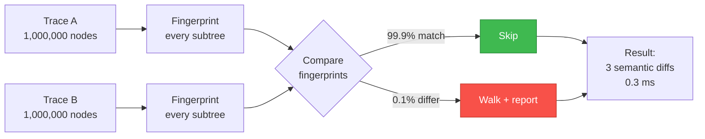

---

## 1. What a trace actually is

An execution trace is a **tree of events**. Each node is one thing the program did — a function call, a database query, an HTTP request, a log line.

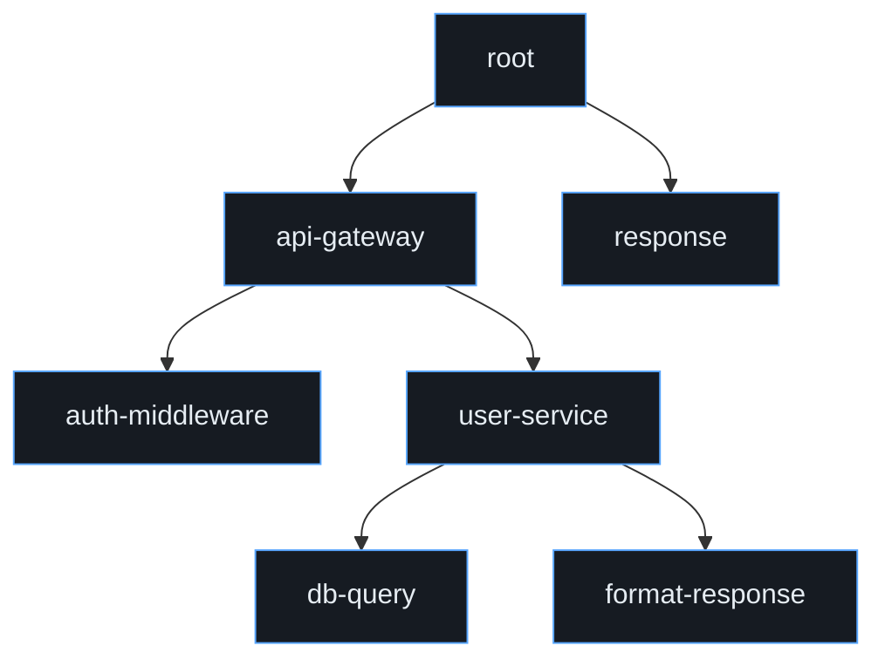

Each node carries **attributes** — the data that actually varies between runs:

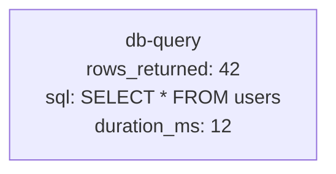

The tree structure is stable across runs. The attributes are what change.

---

## 2. Why a naive diff is too slow

### Naive approach 1: text diff

`diff trace_a.json trace_b.json` treats traces as flat text. One shifted timestamp cascades into thousands of spurious diffs because everything below it is now "different."

### Naive approach 2: full tree comparison

Walk every node in A, find its match in B, compare. That's **O(N²)** — for N = 1,000,000, that's 10¹² operations, roughly 15 minutes, and 8 TB of working memory.

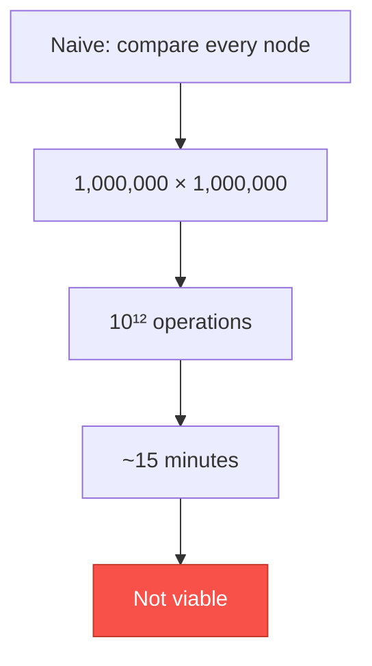

The problem: **99.9% of the comparisons are between things that are already identical.** We're paying full price to confirm what a hash could tell us in O(1).

---

## 3. The insight: fingerprint every subtree

Instead of comparing nodes, compute a **fingerprint** for each node that summarizes everything underneath it.

```
fingerprint(leaf)  = hash(leaf's content)
fingerprint(node)  = hash(node's content + fingerprints of all children)
```

A parent's fingerprint **depends on its children's fingerprints**. Change any leaf, and the change **ripples up to the root**.

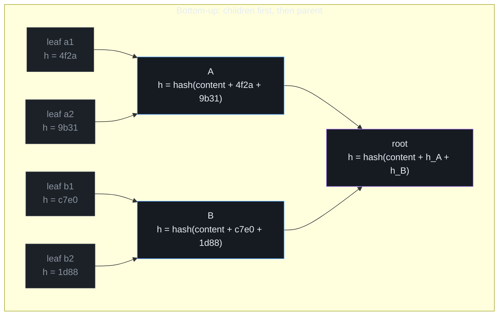

**The crucial property:** if `fingerprint(X) == fingerprint(Y)`, then subtree X is **identical** to subtree Y — with probability 1 − 2⁻²⁵⁶. No need to look inside.

---

## 4. One change ripples up

Change one leaf, and every ancestor's fingerprint changes. Siblings and their subtrees are untouched.

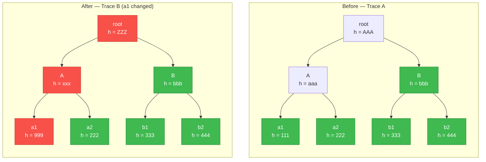

Green = fingerprint unchanged (subtree is identical, can be skipped).  
Red = fingerprint changed (something below here differs).

**B's entire subtree has the same fingerprint on both sides.** That's 3 nodes (B, b1, b2) we never have to look at.

---

## 5. The diff walk — top-down, skip the matches

Now the actual algorithm. Start at the roots. Compare fingerprints. If they match, **stop** — nothing below could possibly differ. If they don't match, recurse into children.

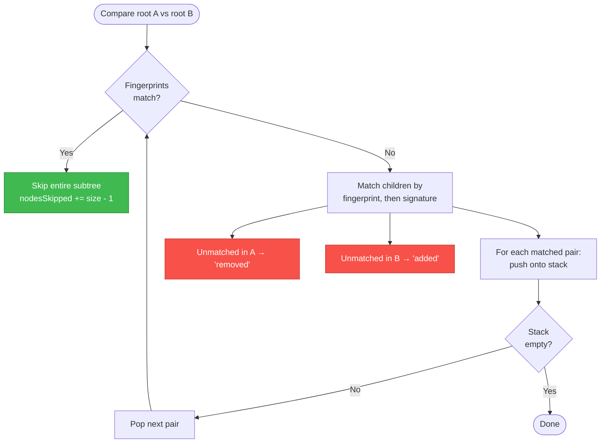

It's an **iterative DFS** with an explicit stack, not recursion — so the walk itself never grows the call stack, no matter how deep the trace goes. (Note: the Merkle *build* in `src/core/merkle-tree.ts` is recursive — bottom-up needs children before parents — so extreme chain-depth is bounded there, not here. Real traces are wide and shallow, which is also what makes §9 work.)

---

## 6. Concrete walkthrough — a small tree

Let's run the algorithm by hand on a 7-node tree. Change one leaf.

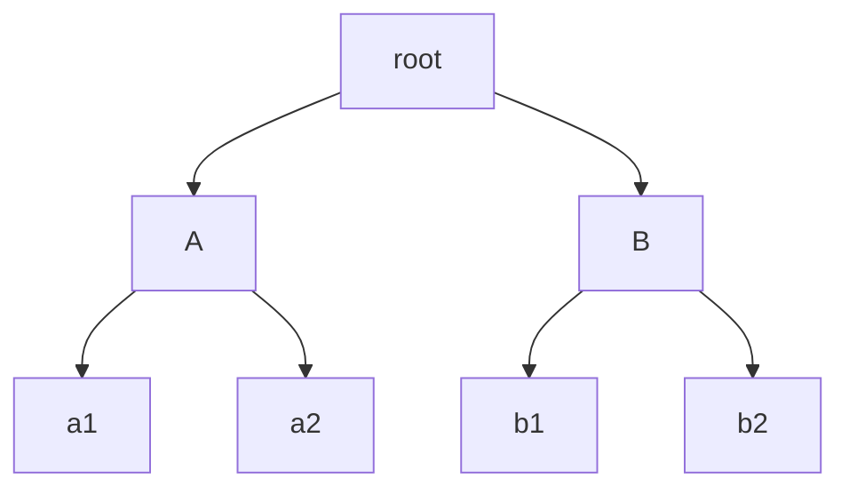

**Trace A** fingerprints: `root=AAA, A=aaa, B=bbb, a1=111, a2=222, b1=333, b2=444`  
**Trace B** fingerprints: `root=ZZZ, A=xxx, B=bbb, a1=999, a2=222, b1=333, b2=444`

### The walk, step by step

> Pop order below follows the real engine: matched pairs are pushed in
> child order, so the stack (LIFO) visits the *last* sibling first.
> Any order yields the same buckets and counts.

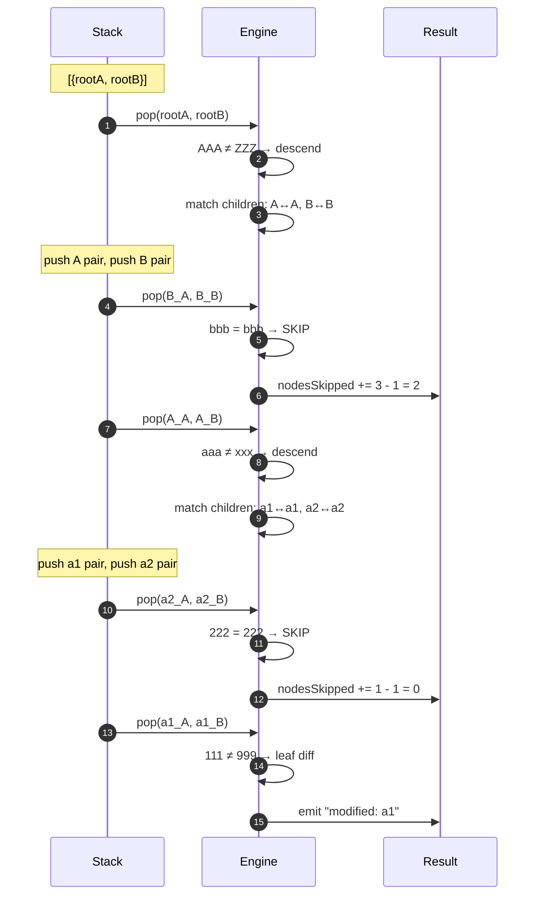

### The result

| Bucket | Count | What |
|---|---|---|
| `nodesVisited` | 5 | root, B, A, a2, a1 |
| `nodesSkipped` | 2 | B-subtree (2) + a2 (0) |
| `nodesBulkReported` | 0 | — |
| **Total** | **7** | = trace A size ✓ |

The one change cost us **5 visits** out of 7 nodes. Not a big win here — but this tree is tiny. See §9 for why depth changes everything.

---

## 7. Three verdicts per node

Fingerprinting gives us a subtle power: we can distinguish **"truly identical"** from **"same after rules."**

We compute **two** fingerprints per node:

- **`rawHash`** — hash of the node's literal content
- **`normalizedHash`** — hash of the content **after** equivalence rules run (ignore timestamps, canonicalize IDs, etc.)

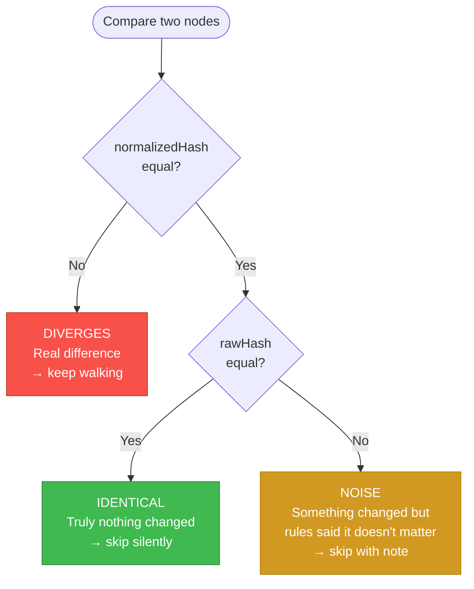

**Why two hashes?** Because "same" is domain-specific:

| Node A | Node B | Verdict | Why |
|---|---|---|---|
| `{ts: 10:00, rows: 42}` | `{ts: 10:05, rows: 42}` | noise | Timestamps stripped by rule |
| `{ts: 10:00, rows: 42}` | `{ts: 10:00, rows: 0}` | diverges | Real change |
| `{ts: 10:00, rows: 42}` | `{ts: 10:00, rows: 42}` | identical | Nothing changed |

With only one hash, noise and identical would look the same — and the UI couldn't paint them yellow vs green.

---

## 8. Skip accounting — the three buckets

Every node in trace A must land in **exactly one** bucket, or the demo numbers lie.

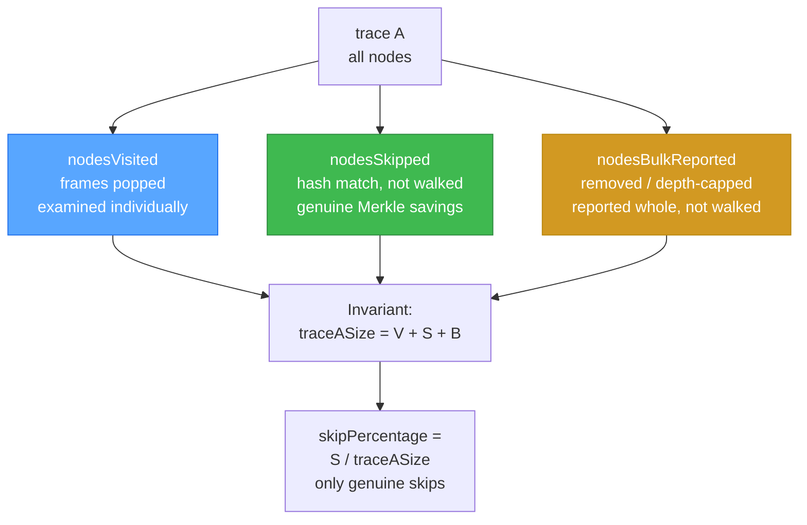

| Bucket | Meaning | Counts toward `skipPercentage`? |
|---|---|---|
| `nodesVisited` | Popped off the stack, inspected | No |
| `nodesSkipped` | Descendants of a **hash-verified match** | **Yes** |
| `nodesBulkReported` | Descendants of **removed** or **depth-capped** subtrees | No |

**Why three buckets and not two?** Because `nodesVisited` must mean exactly one thing: frames popped. If we folded removed/capped subtrees into it, the counter would silently include multi-node lump sums for things we never actually looked at.

**Why isn't `nodesBulkReported` in `skipPercentage`?** Because a removed subtree isn't a skip — it's a **diff**. We didn't ignore it; we flagged it. Only Merkle matches count as genuine savings.

---

## 9. Why depth matters for skip %

This is the trap that bit us once. **Wide shallow trees skip less than deep narrow ones** — even with identical node counts.

Consider: **one leaf changed**, everything else identical.

### Depth 2 — root → 10 groups → 10 leaves (111 nodes)

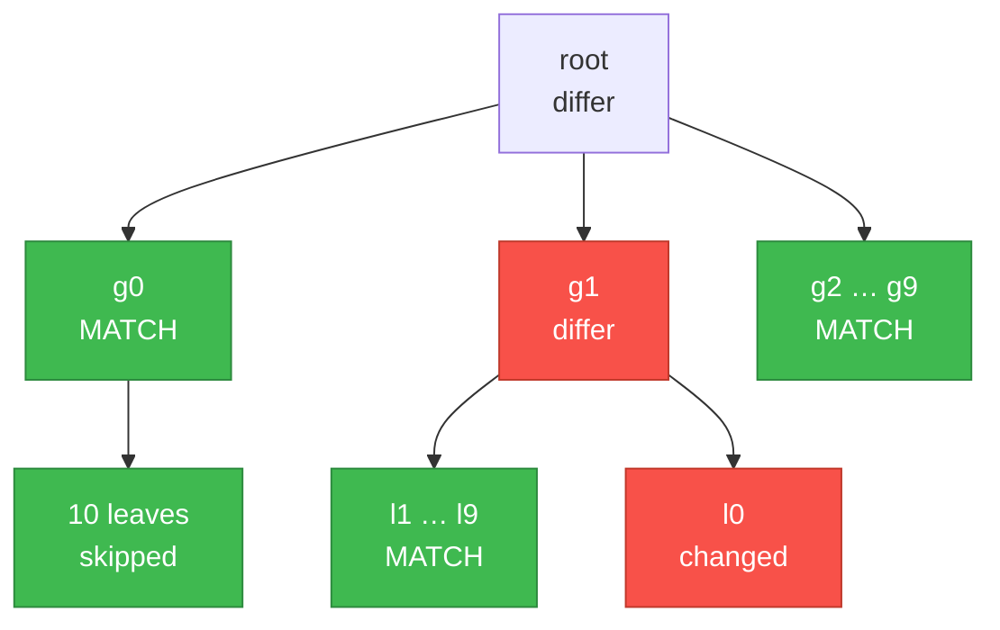

- Skipped: 9 groups × 10 descendants = **90**
- Visited: 1 + 10 + 10 = **21**
- Skip % = 90 / 111 = **81%**

### Depth 3 — root → 10 → 10 → 10 (1,111 nodes)

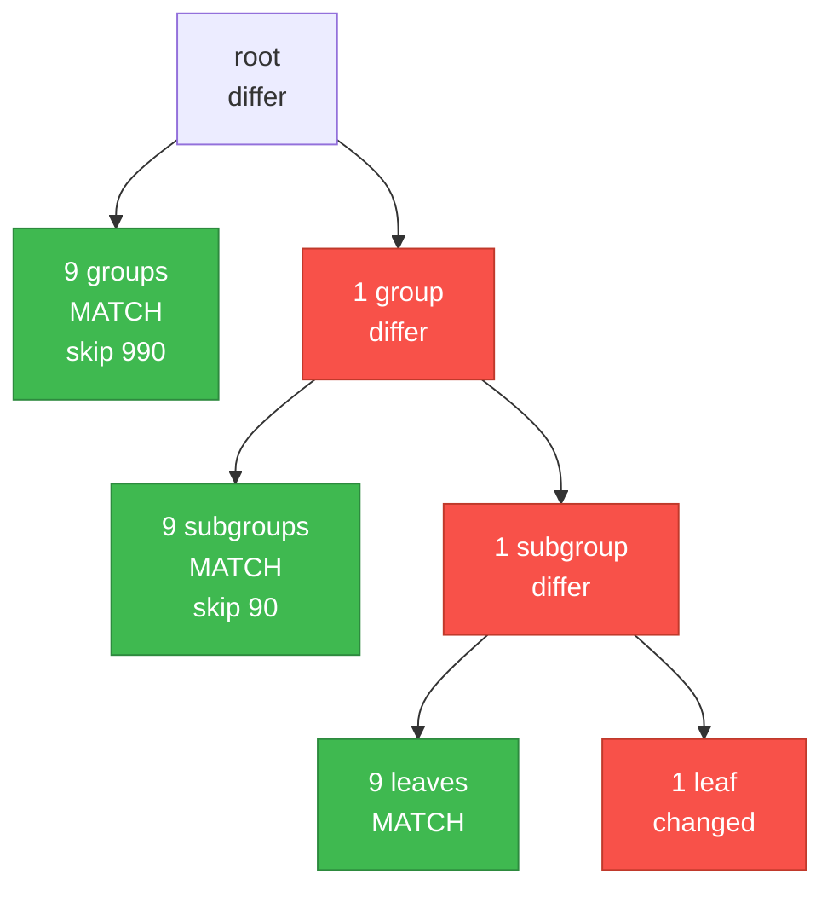

- Skipped: 9 × 110 + 9 × 10 = **1,080**
- Visited: 1 + 10 + 10 + 10 = **31**
- Skip % = 1,080 / 1,111 = **97.2%**

### The trend

| Depth | Nodes | Skipped | Skip % |
|---|---|---|---|
| 2 | 111 | 90 | 81.1% |
| 3 | 1,111 | 1,080 | 97.2% |
| 4 | 11,111 | 11,070 | 99.6% |
| 5 | 111,111 | 111,060 | 99.96% |

**The rule:** every level of depth multiplies the skip rate by roughly `branching / (branching + 1)`, until you asymptote to 100%.

Real traces are 5–10 levels deep (span → sub-span → handler → query → row). That's why a real trace hits 98–99% skip while a 2-level test tree caps at 81%.

**Corollary:** never benchmark your skip-% on a shallow tree. The number isn't the algorithm's fault.

---

## 10. Complexity — the win

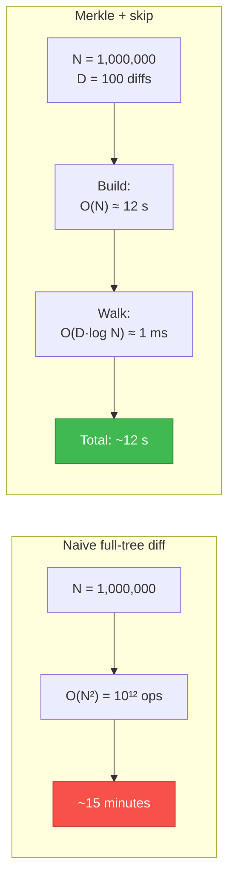

| Operation | Naive | `tracediff` | Asymptotic speedup |
|---|---|---|---|
| Subtree equality | O(N) | O(1) hash compare | 1,000,000× (N=1M) |
| Full tree diff | O(N²) | O(N + D·log N) | ~1,000,000× (N=1M, D=100) |
| Children matching | O(k²) | O(k) hash map | k× |
| Diff walk, identical traces | O(N) | O(1) — root match, stop | 1,000,000× |
| Find first divergence | O(N) | O(log N) down one path | ~50,000× (N=1M) |

**The key mental shift:** the diff cost tracks **how much changed**, not **how big the trace is**. Doubling trace size barely moves the diff phase; doubling diff count doubles it (linearly).

---

## 11. Local single-process pipeline

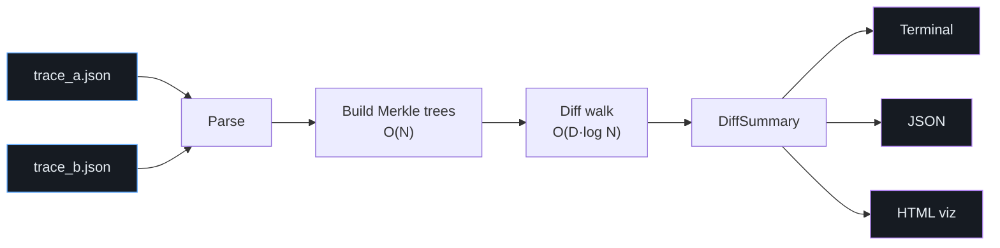

Every stage is **single-pass**. The diff walk is **iterative** (explicit stack — see §5); the Merkle build recurses bottom-up in `src/core/merkle-tree.ts`. The local CLI runs completely in memory with zero external dependencies.

---

## 12. Distributed Cloud Architecture (AWS Serverless Engine)

When traces grow into hundreds of megabytes or production telemetry runs asynchronously, TraceDiff transitions from the local single-process pipeline to an **event-driven AWS serverless architecture** defined in [`infra/template.yaml`](../infra/template.yaml).

To ensure clarity, the cloud architecture is presented in two focused operational phases, with an expandable full-system schematic.

### 12.1 Phase 1: Ingestion & Direct Storage Lifecycle

To bypass the 10 MB payload ceiling of AWS API Gateway, trace dumps are uploaded directly to Amazon S3 via time-limited presigned URLs:

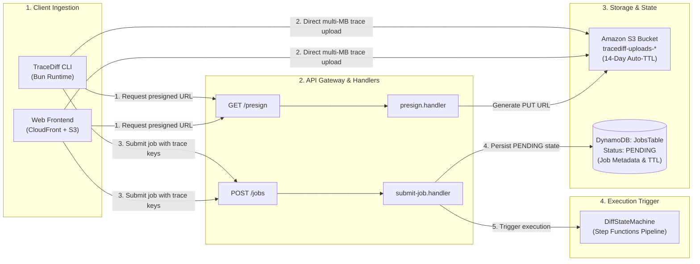

---

### 12.2 Phase 2: Distributed Map-State & Query Pipeline

AWS Step Functions orchestrates parallel worker tasks across Lambda instances, streams paginated divergence items into DynamoDB, and delivers results to the frontend:

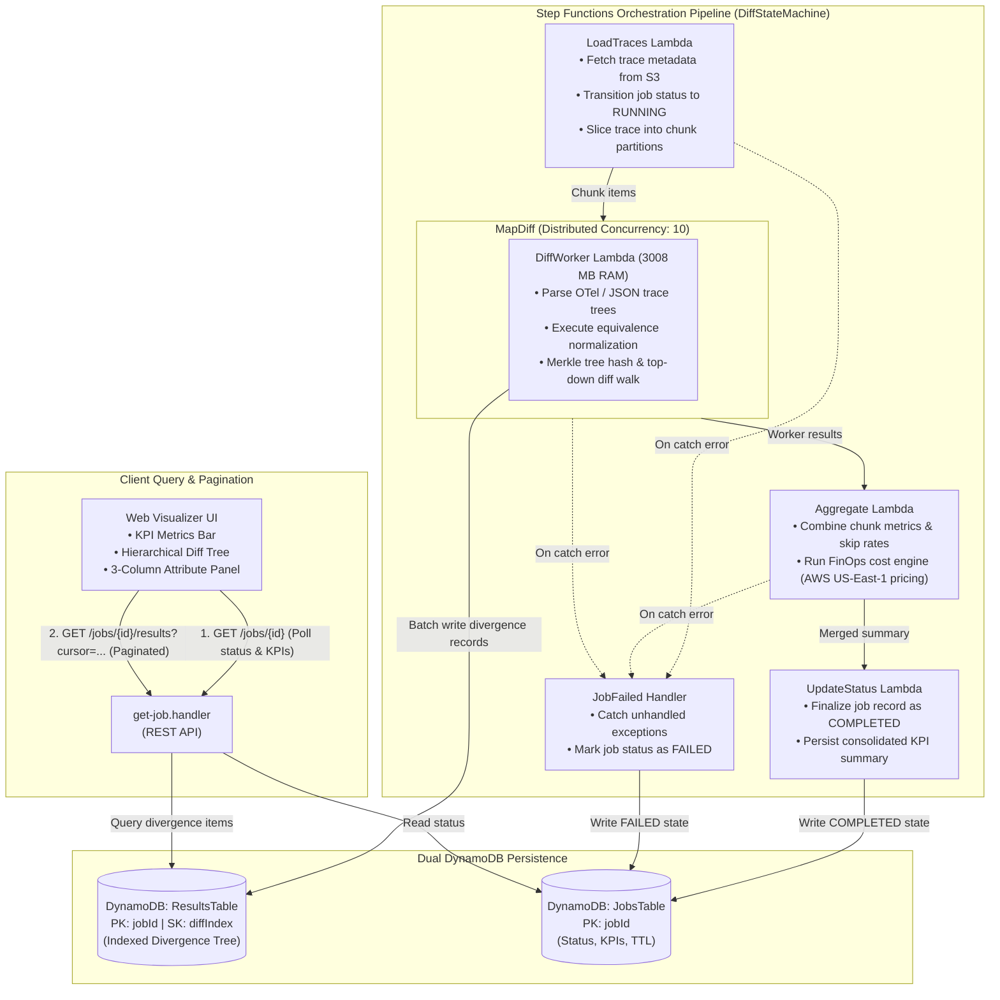

---

### 12.3 Consolidated End-to-End Blueprint (Expandable View)

<details style="margin: 1.5rem 0; padding: 1rem; border: 1px solid var(--border, #30363d); border-radius: 8px; background: rgba(22, 27, 34, 0.5);">
  <summary style="cursor: pointer; font-weight: 600; color: #58a6ff; font-size: 1.05rem;">
    🔍 Click to expand Consolidated Macro Architecture Blueprint
  </summary>
  <p style="margin-top: 0.75rem; color: var(--text-muted, #8b949e); font-size: 0.9rem;">
    Unified schematic mapping client upload, API Gateway endpoints, Step Functions Map-State, S3 storage, and dual DynamoDB persistence:
  </p>

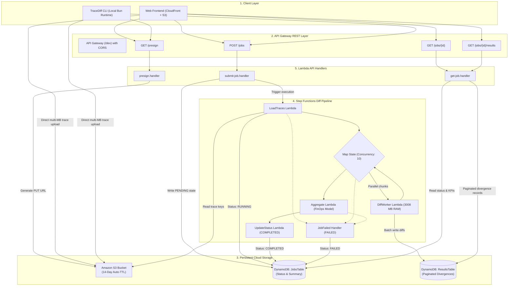

</details>

---

### 12.4 Key Architectural Pillars

1. **Direct S3 Presigned Uploads**: Bypasses API Gateway's 10 MB limit, enabling multi-hundred-megabyte trace ingestion with automated 14-day TTL cleanup.
2. **Step Functions Map-State Concurrency**: Slices large traces into chunks and fans out across 10 concurrent `DiffWorker` Lambda instances (provisioned with 3,008 MB RAM each).
3. **Dual DynamoDB Tables**: Separates coarse-grained job state (`JobsTable`) from fine-grained, paginated divergence items (`ResultsTable` with composite key `jobId` + `diffIndex`).
4. **Embedded FinOps Cost Engine**: Calculates monetary cost deltas (Lambda GB-seconds, DynamoDB RCUs/WCUs, S3 requests) using official AWS US-East-1 list pricing.
5. **Zero-Webpack Bun Bundling**: Builds single-file Lambda handlers targeting Node.js 22.x with infrastructure managed via AWS SAM.

---

## Cheat sheet

| Term | One-line meaning |
|---|---|
| **Trace tree** | Nested nodes of events; edges are "called" or "spawned" |
| **Fingerprint** | SHA-256 of a node's content + its children's fingerprints |
| **`rawHash`** | Fingerprint of the literal content |
| **`normalizedHash`** | Fingerprint after equivalence rules run |
| **Identical** | Both hashes match → skip silently |
| **Noise** | Only `rawHash` differs → skip with note |
| **Diverges** | `normalizedHash` differs → recurse |
| **`nodesVisited`** | Frames popped off the diff stack |
| **`nodesSkipped`** | Descendants of hash-verified matches (real savings) |
| **`nodesBulkReported`** | Descendants of removed / depth-capped subtrees |
| **`skipPercentage`** | `nodesSkipped / traceASize` |
| **Invariant** | `traceASize == visited + skipped + bulkReported` |

---

## One diagram to rule them all

If you only have 30 seconds to explain this to a judge:

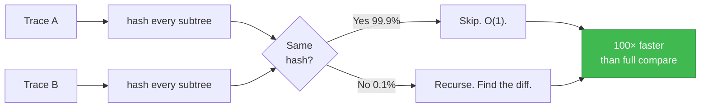

That's the whole idea. Everything else is engineering around it.

<script src="https://cdn.jsdelivr.net/npm/mermaid@10/dist/mermaid.min.js"></script>
<script>
  (function() {
    function renderMermaid() {
      if (typeof mermaid === "undefined") return;
      var blocks = document.querySelectorAll("pre code.language-mermaid, div.language-mermaid pre code, pre.language-mermaid, code.language-mermaid");
      blocks.forEach(function(code) {
        var container = code.closest(".language-mermaid") || code.closest("pre") || code;
        var div = document.createElement("div");
        div.className = "mermaid";
        div.textContent = code.textContent.trim();
        container.parentNode.replaceChild(div, container);
      });
      mermaid.initialize({ startOnLoad: false, theme: "dark", securityLevel: "loose" });
      mermaid.run();
    }
    if (document.readyState === "loading") {
      document.addEventListener("DOMContentLoaded", renderMermaid);
    } else {
      renderMermaid();
    }

    document.querySelectorAll("details").forEach(function(detail) {
      detail.addEventListener("toggle", function() {
        if (detail.open && typeof mermaid !== "undefined") {
          var unrendered = detail.querySelectorAll("pre code.language-mermaid, div.language-mermaid pre code, pre.language-mermaid");
          if (unrendered.length > 0) {
            unrendered.forEach(function(code) {
              var container = code.closest(".language-mermaid") || code.closest("pre") || code;
              var div = document.createElement("div");
              div.className = "mermaid";
              div.textContent = code.textContent.trim();
              container.parentNode.replaceChild(div, container);
            });
          }
          mermaid.run({ nodes: detail.querySelectorAll(".mermaid") });
        }
      });
    });
  })();
</script>
