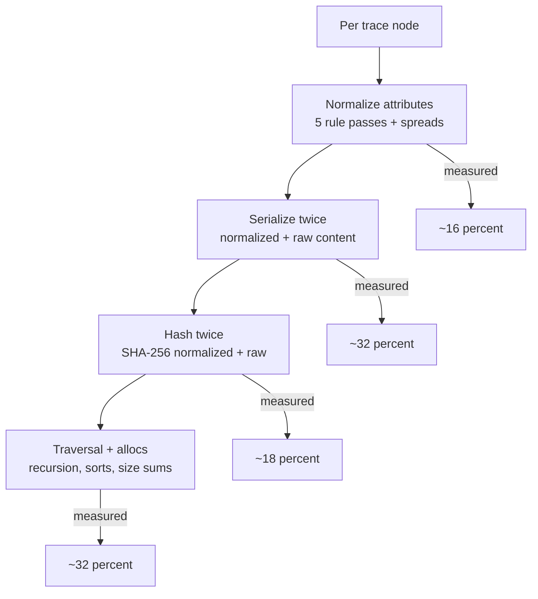

[Home](index.md) · **Developers** · [Hash experiment](hash-experiment.md) · [Engineering log](engineering-log.md)

# Performance notes for contributors

## 1. Cost model — where build time goes (100K nodes × 2 traces)

One sentence frames every decision below: **the build is O(N) and unavoidable — all wins come from doing less per node.** The diff walk was already fast; the build was 96% of total time.

## 2. Hot-spot map (before tuning)

| Cost | Location | Shape of waste |
|---|---|---|
| Rule passes | `src/rules/registry.ts` → `applyRules` | 5 `Object.entries` loops + intermediate maps per node (~600 ms / 200K nodes) |
| Serialization | `src/core/hash.ts` → `canonicalSerialize`, called twice per node in `src/core/merkle-tree.ts` | key sort on every call (~1200 ms) |
| Hashing | 2× SHA-256 per node | ~660 ms, native C code — the floor |
| Traversal | `buildMerkleTree` recursion, `map`+`join` hash feed, `localeCompare` sort, `reduce` size sum | ~1200 ms combined |
| Diff walk extras | `src/core/diff.ts` (double `classify` scan, per-field serialize), `src/core/match-children.ts` (label-bucket Maps, `flat()` allocs) | ~140 ms walk at 100K/100 |

## 3. What shipped (Phase 1 — all verdict-preserving)

- **Fused single-pass normalization** (`registry.ts` + `RuleFuse` descriptors on all 5 built-ins): one attribute loop instead of five; per-key classification cached (keys repeat heavily). Arrays containing custom rules fall back to sequential `reduce()` — pluggability intact. `applyRules`: 600 → ~130 ms.
- **Cached key-order serializer** (`hash.ts`): attribute key-sets repeat (~20 shapes over 100K nodes); sorted orders cached per shape with a collision-safe fallback (deterministic for every input, `hasOwn`-guarded against prototype members).
- **Single-pass hash feed + traversal** (`merkle-tree.ts`): one child loop feeds both digests (streaming `update` ≡ `update(joined)` — identical digests), single loop for size accumulation, codepoint instead of ICU `localeCompare` for concurrent sorts.
- **Diff-walk cuts** (`diff.ts`, `match-children.ts`): use `classifyDiff`'s returned `classifiedBy` instead of re-scanning rules; `===` fast path before per-field serialize (behavior-preserving: falls through to canonical compare for NaN); skip the label-bucketing pass when nothing is unmatched.

## 4. Verification methodology (the rule for all of the above)

No change landed without three proofs: (a) `bun test` green with recall exact on all bench cells, (b) a **hash-stability oracle** — digest-over-all-hashes per bench cell compared against pristine-HEAD output (bit-identical across 200K+ hashes for every safe change), (c) before/after `bun run bench`. The oracle is what lets us claim "zero verdict changes" as fact rather than belief.

## 5. What we deliberately didn't change

- **Bucket math** (`numeric-tolerance`): widening buckets would cut boundary straddles but silently merge real 5–10% regressions. The no-false-merge guarantee (same bucket implies within tolerance) is load-bearing.
- **Dual-hash architecture** (`normalizedHash`/`rawHash`): collapsing it destroys the identical-vs-noise distinction the UI paints green vs yellow.
- **SHA-256 default**: see the [hash experiment](hash-experiment.md) for the full story.

## 6. Remaining ceiling

After Phase 1 the floor is serialize + native-hash (~2.2 s of 2.3 s at 100K). Further gains need data-model surgery or the WASM tradeoffs documented in the [hash experiment](hash-experiment.md).

