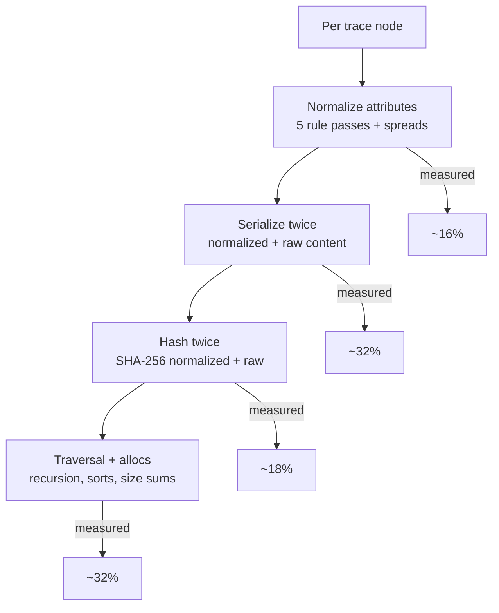
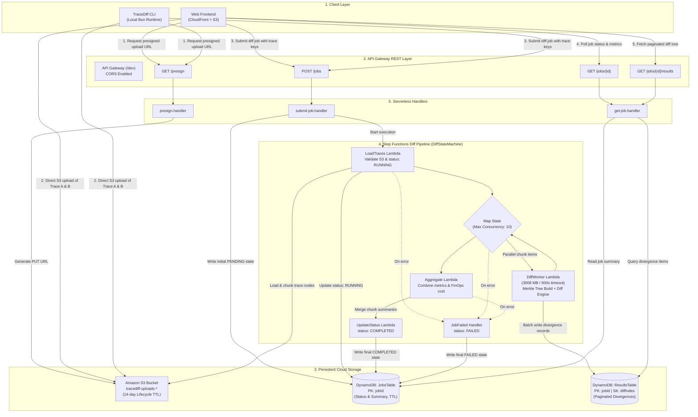

[← Open TraceDiff App](../) · [Home](index.html) · **Developers** · [Hash experiment](hash-experiment.html) · [Engineering log](engineering-log.html)

# Performance notes for contributors

## 1. Cost model — where build time goes (100K nodes × 2 traces)

One sentence frames every decision below: **the build is O(N) and unavoidable — all wins come from doing less per node.** The diff walk was already fast; the build was 96% of total time.

## 2. Hot-spot map (before tuning)

| Cost | Location | Shape of waste |
|---|---|---|
| Rule passes | `src/rules/registry.ts` → `applyRules` | 5 `Object.entries` loops + intermediate maps per node (~600 ms / 200K nodes) |
| Serialization | `src/core/hash.ts` → `canonicalSerialize`, called twice per node in `src/core/merkle-tree.ts` | key sort on every call (~1200 ms) |
| Hashing | 2× SHA-256 per node | ~660 ms, native C code — the floor |
| Traversal | `buildMerkleTree` recursion, `map`+`join` hash feed, `localeCompare` sort, `reduce` size sum | ~1200 ms combined |
| Diff walk extras | `src/core/diff.ts` (double `classify` scan, per-field serialize), `src/core/match-children.ts` (label-bucket Maps, `flat()` allocs) | ~140 ms walk at 100K/100 |

## 3. What shipped (Phase 1 — all verdict-preserving)

- **Fused single-pass normalization** (`registry.ts` + `RuleFuse` descriptors on all 5 built-ins): one attribute loop instead of five; per-key classification cached (keys repeat heavily). Arrays containing custom rules fall back to sequential `reduce()` — pluggability intact. `applyRules`: 600 → ~130 ms.
- **Cached key-order serializer** (`hash.ts`): attribute key-sets repeat (~20 shapes over 100K nodes); sorted orders cached per shape with a collision-safe fallback (deterministic for every input, `hasOwn`-guarded against prototype members).
- **Single-pass hash feed + traversal** (`merkle-tree.ts`): one child loop feeds both digests (streaming `update` ≡ `update(joined)` — identical digests), single loop for size accumulation, codepoint instead of ICU `localeCompare` for concurrent sorts.
- **Diff-walk cuts** (`diff.ts`, `match-children.ts`): use `classifyDiff`'s returned `classifiedBy` instead of re-scanning rules; `===` fast path before per-field serialize (behavior-preserving: falls through to canonical compare for NaN); skip the label-bucketing pass when nothing is unmatched.

## 4. Verification methodology (the rule for all of the above)

No change landed without three proofs: (a) `bun test` green with recall exact on all bench cells, (b) a **hash-stability oracle** — digest-over-all-hashes per bench cell compared against pristine-HEAD output (bit-identical across 200K+ hashes for every safe change), (c) before/after `bun run bench`. The oracle is what lets us claim "zero verdict changes" as fact rather than belief.

## 5. What we deliberately didn't change

- **Bucket math** (`numeric-tolerance`): widening buckets would cut boundary straddles but silently merge real 5–10% regressions. The no-false-merge guarantee (same bucket implies within tolerance) is load-bearing.
- **Dual-hash architecture** (`normalizedHash`/`rawHash`): collapsing it destroys the identical-vs-noise distinction the UI paints green vs yellow.
- **SHA-256 default**: see the [hash experiment](hash-experiment.html) for the full story.

## 6. Remaining ceiling

After Phase 1 the floor is serialize + native-hash (~2.2 s of 2.3 s at 100K). Further gains need data-model surgery or the WASM tradeoffs documented in the [hash experiment](hash-experiment.html).

---

## 7. Distributed Cloud Architecture (AWS Serverless Engine)

While TraceDiff runs sub-second comparisons locally via Bun, comparing massive traces (multi-megabyte JSON payloads, hundreds of thousands of spans) in production environments requires horizontally scalable cloud infrastructure. TraceDiff implements an **asynchronous, event-driven serverless pipeline** on AWS defined in [`infra/template.yaml`](../infra/template.yaml).

### 7.1 Architecture & Data Flow Diagram

---

### 7.2 Detailed Component Breakdown

#### 1. Ingestion: Direct S3 Presigned Upload Pattern
* **Problem**: AWS API Gateway enforces a strict **10 MB payload limit** on synchronous REST requests, making direct POST submissions of production distributed trace dumps impossible.
* **Solution**: The client invokes `GET /presign`, triggering [`presign.handler`](../src/lambda/presign.ts). This issues time-limited S3 presigned PUT URLs with CORS pre-flight authorization. The client uploads multi-hundred-megabyte JSON traces directly to the private S3 bucket (`tracediff-uploads-${AccountId}-${Env}`), bypassing API Gateway compute and memory entirely.
* **Lifecycle Governance**: Raw traces in S3 auto-expire after 14 days via AWS S3 Lifecycle Rules, preventing storage cost buildup from benchmark runs.

#### 2. Job Submission & Orchestration: AWS Step Functions
* **Async Job Queuing**: The client initiates comparison by POSTing to `/jobs` with the S3 object keys. [`submit-job.handler`](../src/lambda/submit-job.ts) writes a `PENDING` record to DynamoDB and invokes the **AWS Step Functions state machine** (`DiffStateMachine`).
* **Map-State Parallel Processing**: The state machine orchestrates the comparison lifecycle:
  1. **`LoadTracesFunction`** ([`src/lambda/load-traces.ts`](../src/lambda/load-traces.ts)): Validates the S3 assets, transitions job status to `RUNNING`, and prepares chunk definitions.
  2. **`MapDiff` (Distributed Map State)**: Concurrently processes trace chunks with a `MaxConcurrency` of 10, invoking instances of **`DiffWorkerFunction`**.
  3. **`DiffWorkerFunction`** ([`src/lambda/diff-worker.ts`](../src/lambda/diff-worker.ts)): Allocated **3,008 MB RAM** and a 15-minute timeout. It runs the Merkle tree builder and diff engine over the assigned trace partition, executing equivalence normalization rules in memory and batch-writing discovered divergence records to DynamoDB.
  4. **`AggregateFunction`** ([`src/lambda/aggregate.ts`](../src/lambda/aggregate.ts)): Merges chunk metrics (total nodes evaluated, percentage skipped, semantic vs. noise breakdown, execution latency) and runs the embedded FinOps cost engine.
  5. **`UpdateStatusFunction`** ([`src/lambda/update-status.ts`](../src/lambda/update-status.ts)): Finalizes the job record in DynamoDB with status `COMPLETED` and attaches the consolidated summary.
  6. **Fault-Tolerant Catch Blocks**: Every step catches `States.ALL` errors and redirects to `JobFailed`, ensuring unhandled worker exceptions mark the job as `FAILED` with actionable error telemetry instead of hanging.

#### 3. Persistence: Dual DynamoDB Architecture
The system separates operational job metadata from high-cardinality diff results across two DynamoDB tables using **On-Demand (PAY_PER_REQUEST)** billing:
* **`JobsTable` (`tracediff-jobs-${Environment}`)**:
  * **Partition Key**: `jobId` (String).
  * **Payload**: High-level execution status (`PENDING`, `RUNNING`, `COMPLETED`, `FAILED`), trace metadata, execution duration, node counts, skip percentages, FinOps cost deltas, and a TTL timestamp.
  * **Time-to-Live (TTL)**: Enables automatic record deletion after expiration.
* **`ResultsTable` (`tracediff-results-${Environment}`)**:
  * **Partition Key**: `jobId` (String).
  * **Sort Key**: `diffIndex` (Number).
  * **Payload**: Exact attribute-level divergence details (path, node label, divergence type, classification rule, before/after values).
  * **Pagination**: Enables fast, indexed range queries (`GET /jobs/{id}/results?limit=50&cursor=...`) so the frontend visualizer loads sub-second pages even on traces with tens of thousands of diffs.

#### 4. FinOps Cost Engine Integration
Embedded within the backend processing is the **AWS FinOps Cost Model** ([`src/finops/costEngine.ts`](../src/finops/costEngine.ts)):
* Reads span attributes (e.g., runtime duration, memory allocation, DynamoDB read/write units, S3 requests, payload bytes).
* Calculates architectural cost deltas against official AWS US-East-1 list pricing (Lambda GB-seconds at $0.0000166667, DynamoDB RCUs at $0.00000025, S3 operations, etc.).
* Outputs prescriptive cost optimization alerts (e.g., flagging cold-start loops, memory over-provisioning, or database read-amplification regressions) alongside structural code differences.

#### 5. Frontend & Edge Distribution
* **Amazon S3**: Hosts the static web application (`frontend/index.html`, `frontend/js/`, `frontend/css/`).
* **Amazon CloudFront**: Acts as the global Content Delivery Network (CDN), terminating SSL, caching static assets at edge locations, and minimizing latency for global clients.
* **Automated CI/CD Invalidation**: The deployment script automatically purges CloudFront distribution caches upon pushing frontend updates (`package.json: deploy:frontend`).

#### 6. Build & Packaging Architecture
* **Language & Runtime**: Authored in strict TypeScript, compiled to Node.js 22.x compatibility.
* **Zero-Webpack Bundler**: Lambda functions are bundled using Bun (`bun build src/lambda/*.ts --target=node --outdir=dist/lambda`), producing single, lightweight `.js` files with zero runtime dependencies.
* **Infrastructure as Code (IaC)**: Built with AWS SAM (Serverless Application Model) and CloudFormation, enabling reproducible zero-drift deployments via `bash infra/deploy.sh` or GitHub Actions.

