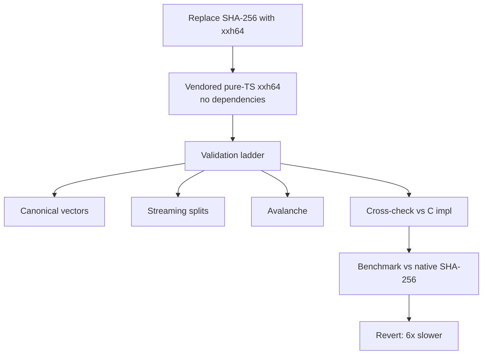

[← Open TraceDiff App](../) · [Home](index.html) · [Developers](developers.html) · **Hash experiment** · [Engineering log](engineering-log.html)

# The xxhash experiment: validated, measured, reverted

This is the story of an optimization that was correct, thoroughly tested — and lost on measurement. It stays written down so nobody re-runs it blind.

## 1. The idea

SHA-256 was ~18% of Merkle build time. xxHash64 is famously ~10× faster than SHA-256 in C. A vendored pure-TypeScript xxh64 (zero dependencies, matching the repo's stance) could cut the hash stage substantially.

## 2. Validation ladder (all passed — then kept passing for the wrong reason)

- Canonical vectors (seed 0): `""` → `ef46db3751d8e999`, `"abc"` → `44bc2cf5ad770999`.
- Streaming split-feed equality at every split point; avalanche ~34/64 bits.
- **Then the scare:** a length sweep against `xxhash-wasm@1.1.0` (real C implementation) diverged on all inputs ≥ 8 bytes — exposing **two stripe-path bugs** the vectors couldn't catch (short inputs never touch stripes):
  1. `round` was missing its final `×P1`.
  2. `round` computed `(acc + input) × P2` instead of `acc + (input × P2)` — identical only when `acc` is 0, i.e. exactly the tested paths.
- After fixing, full agreement at every length class (short, 8-byte tail, 4-byte tail, stripes, multi-stripe) — verified further by an independent BigInt reference implementation, which itself caught one bad debug script along the way.

## 3. Measured verdict (the part that killed it)

20K digests of Merkle-representative inputs:

| Pattern | SHA-256 (native C) | Vendored TS xxh64 |
|---|---|---|
| One-shot ~230 B | ~25 ms | ~200 ms (~8× slower) |
| JS-concat + one-shot | ~23 ms | ~214 ms |

Interpreted 64-bit limb arithmetic cannot beat `node:crypto` C code on short inputs. Wiring it in made the Merkle build **slower** (2207 → 7716 ms at 100K), so the wiring was reverted the same session. Lesson recorded: **never adopt a "faster" primitive without measuring it in situ** — textbook speedups assume C-vs-C, not interpreted-vs-native.

## 4. The WASM footnote (measured, not adopted)

`xxhash-wasm@1.1.0` in temp space only (repo untouched): ~3× faster than SHA-256 one-shot (~8 ms vs ~25 ms) — but its *streaming* API is slower than SHA-256 streaming (WASM boundary-crossing cost per tiny update dominates). The win needs a concat-in-JS + single-call pattern per node: estimated ~20% total-bench gain in exchange for the repo's first runtime dependency, digest migration, and cache invalidation. Not worth it today; the integration shape is recorded here for the day a latency SLO demands it.

